# 后端代码地图与流程图

本文档是 `apps/api` 的**逐层阅读笔记 + 可直接渲染的图表源**，用于绘制后端流程图与架构图。
它描述的是**当前已部署实现**，不包含尚未实施的私有 Admin 目标架构（那部分见[总体架构](architecture.md)）。

- 覆盖范围：`apps/api/src`（进程、HTTP 管线、路由、领域服务、数据模型），以及它与 Web、SQLite、媒体目录、SMTP 的边界。
- 图表全部使用 Mermaid，可直接粘贴到支持 Mermaid 的编辑器；每个图后附「节点清单」，便于手工绘制。
- 事实来源：源码逐文件阅读，路由表由 Fastify `printRoutes()` 实测导出，测试套件实测 **120/120 通过**。
- 维护要求：改动路由、守护逻辑或数据模型时同步更新本文档，并运行 `npm run check:docs`。

## 1. 后端在系统中的位置

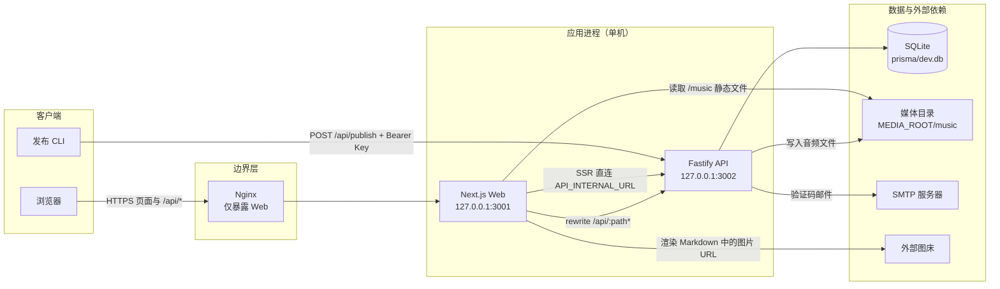

节点清单：

| 节点 | 说明 |
|---|---|
| 浏览器 | 只使用同源 `/api/*`，Cookie 因此保持同域 |
| Nginx | 生产环境唯一公开入口；API 与 Web 均只监听回环地址 |
| Next.js Web | 页面、SSR、静态资源；`next.config.ts` 的 rewrite 把 `/api/:path*` 转发到 `API_INTERNAL_URL` |
| Fastify API | 全部数据访问、认证授权、限流、媒体、发布逻辑的唯一持有者 |
| SQLite | 通过 Prisma 7.9 + `@prisma/adapter-better-sqlite3` 访问，相对路径以仓库根解析 |
| 媒体目录 | 目前只有音乐；默认 `apps/web/public`，是单机部署约束 |
| SMTP | 注册与重置验证码的自研 SMTP 客户端（无第三方邮件库） |
| 外部图床 | 图片不经过本站后端，仅作为自由文本 URL 存库 |

## 2. 分层结构

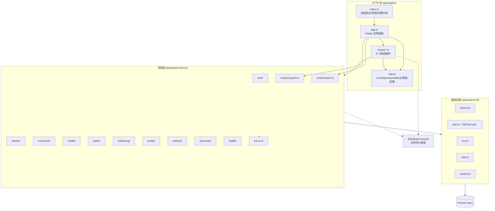

分层规则（改动时的硬约束）：

1. **路由层只处理 HTTP 关注点**：状态码、envelope、Cookie、来源校验、限流入口、取 body。不写数据库查询与业务规则。
2. **领域层不感知 Fastify**：`server/<domain>/*-service.ts` 只接收普通对象、抛 `ServiceError`，因此可以被测试直接调用。
3. **DTO 与查询投影放在 `*-dto.ts`**：`select` 常量与 `toXxxDto()` 成对出现，保证不会把 `password`、`apiKey`、`email` 泄漏给公开响应。
4. **Web 与 API 不互相导入**：只共享 `@kpblog/contracts` 的可序列化类型。

## 3. 目录地图

| 路径 | 职责 | 关键点 |
|---|---|---|
| `apps/api/src/index.ts` | 进程入口 | 启动前配置校验、端口/主机解析、优雅关闭 |
| `apps/api/src/bootstrap-env.ts` | 环境初始化 | 必须在任何读配置的模块之前导入；统一走 `scripts/load-env.mjs` |
| `apps/api/src/app.ts` | Fastify 装配 | 请求 ID、压缩钩子、Cookie/CORS/Multipart、路由前缀 `/api`、错误处理器 |
| `apps/api/src/http.ts` | HTTP 工具 | `apiSuccess`/`apiFailure`、`requestBody`、`assertRequestOrigin`、`sessionToken`、`multipartFiles` |
| `apps/api/src/routes/` | 8 个路由插件 | auth、articles、comments、media、public、publishing、profile、settings |
| `apps/api/src/server/request-guard.ts` | 来源、IP、限流 | 同源校验、`requestIp`、5 个限流原语 |
| `apps/api/src/server/errors.ts` | 错误类型 | `ServiceError` + 5 个工厂函数 |
| `apps/api/src/server/compression.ts` | 响应压缩 | brotli/gzip，>1 KB 且为文本类 |
| `apps/api/src/server/*/` | 10 个领域目录 | 每个目录含 service，部分含 dto / order |
| `apps/api/src/lib/` | 基础设施 | prisma、JWT/bcrypt、env 校验、slug/摘要、Markdown frontmatter |
| `apps/api/tests/` | 20 个测试文件 | 每个文件独立临时 SQLite 库 |
| `apps/api/scripts/` | 运维脚本 | OpenAPI 契约校验、SMTP 诊断、SQLite 备份、冒烟种子 |

## 4. 请求生命周期（全局管线）

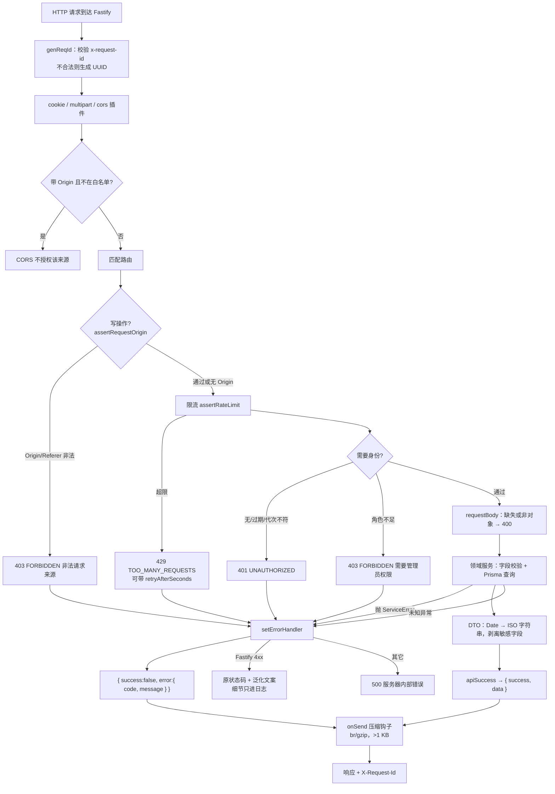

关键顺序（**不要调换**）：

- 请求 ID 在最前：日志与响应头共用同一个可检索编号。
- 压缩钩子注册在**根实例**上：Fastify 的 `onSend` 在注册时刻捕获钩子链，用 `app.register()` 装的插件钩子不会作用于之后注册的路由。
- 写操作顺序固定为 **来源校验 → 限流 → 鉴权 → 取 body → 服务**。授权矩阵测试依赖这个顺序，并显式核对 403 的文案是「需要管理员权限」而不是「非法请求来源」。
- 错误响应对 `ServiceError` 保留状态码与 message；对 Fastify 自身的 4xx（如畸形 JSON）只返回泛化文案，细节只进服务端日志。

## 5. 路由总表（37 条路径 / 45 个方法端点）

下表由 Fastify `printRoutes()` 实测导出。计数口径：`check:openapi` 报的「37 条路由」按**路径**计数，本表按**方法**计数为 45（不含框架自动补的 `HEAD`/`OPTIONS`）。

方法后的「守护」列：`—` 公开；`来源` = `assertRequestOrigin`；`会话` = `requireAuthSession`；`管理员` = `requireAdminSession`；`API Key` = `verifyPublishApiKey`。

| 方法 | 路径 | 守护 | 限流 | 服务入口 |
|---|---|---|---|---|
| GET | `/health` | — | — | `checkHealth` |
| GET | `/api/auth/registration-options` | — | — | `getRegistrationCapabilities` |
| POST | `/api/auth/verification-code` | 来源 | IP 5/时 + 目标 5/时 | `sendVerificationCode("register")` |
| POST | `/api/auth/register` | 来源 | IP 5/时 | `registerUser` |
| POST | `/api/auth/login` | 来源 | IP 20/15 分 + 账号冷却 | `loginUser` |
| POST | `/api/auth/password/reset-code` | 来源 | IP 5/时 + 目标 5/时 | `requestPasswordReset` |
| POST | `/api/auth/password/reset` | 来源 | IP 10/时 | `resetPasswordWithCode` |
| PUT | `/api/auth/password` | 来源 + 会话 | — | `changeOwnPassword` |
| POST | `/api/auth/logout` | 来源 | — | `logoutCurrentUser` |
| GET | `/api/auth/me` | 会话 | — | `getCurrentSession` |
| GET | `/api/auth/key` | 管理员 | — | `getCurrentUserApiKey` |
| POST | `/api/auth/key` | 来源 + 管理员 | — | `regenerateCurrentUserApiKey` |
| GET | `/api/articles` | —（可选会话影响可见性） | — | `listArticles` |
| POST | `/api/articles` | 来源 + 管理员 | — | `createArticle` |
| GET | `/api/articles/{id}` | —（草稿仅管理员） | — | `getArticleById` |
| PUT | `/api/articles/{id}` | 来源 + 管理员 | — | `updateArticle` |
| DELETE | `/api/articles/{id}` | 来源 + 管理员 | — | `deleteArticle` |
| GET | `/api/public/articles/{slug}` | — | — | `getPublicArticleBySlug` |
| GET | `/api/public/articles/{slug}/adjacent` | — | — | `getArticleAdjacentData` |
| GET | `/api/public/article-index` | — | — | `getArticleIndexPageData` |
| GET | `/api/public/tags/{slug}` | — | — | `getTagArchivePageData` |
| GET | `/api/public/categories/{slug}` | — | — | `getCategoryArchivePageData` |
| GET | `/api/public/settings` | — | — | `getPublicSettings` |
| GET | `/api/public/layout` | — | — | `getContentLayoutData` |
| GET | `/api/public/home` | — | — | `getHomePageData` |
| GET | `/api/public/archive` | — | — | `getArchiveData` |
| GET | `/api/public/profile` | — | — | `getProfile` |
| GET | `/api/public/guestbook` | — | — | `listPublicGuestbook` |
| GET | `/api/public/rss-data` | — | — | `getRssFeedData` |
| GET | `/api/public/sitemap-data` | — | — | `getSitemapData` |
| GET | `/api/tags` | — | — | `listTags` |
| GET | `/api/categories` | — | — | `listCategories` |
| GET | `/api/comments?postId=` | — | — | `listPublicComments` |
| GET | `/api/comments` | 管理员 | — | `listAdminComments` |
| POST | `/api/comments` | 来源 | IP 10/10 分 | `createComment` |
| PUT | `/api/comments/{id}` | 来源 + 管理员 | — | `moderateComment` |
| DELETE | `/api/comments/{id}` | 来源 + 管理员 | — | `deleteComment` |
| POST | `/api/guestbook` | 来源 | IP 10/10 分 | `createGuestbookEntry` |
| GET | `/api/music` | — | — | `listMusicTracks` |
| POST | `/api/music` | 来源 + 管理员 | — | `createMusicFromFile` 或 `createMusicFromUrl` |
| DELETE | `/api/music/{id}` | 来源 + 管理员 | — | `deleteMusicTrack` |
| PUT | `/api/settings` | 来源 + 管理员 | — | `updateSettings` |
| GET | `/api/settings` | —（只返回白名单键） | — | `getSettingsMap` |
| PUT | `/api/profile` | 来源 + 管理员 | — | `updateProfile` |
| POST | `/api/import` | 来源 + 管理员 | — | `importFiles` |
| POST | `/api/publish` | 来源 + API Key | IP 30/15 分 | `publishMarkdown` |

Fastify 会自动补 `HEAD`（GET）与 `OPTIONS`（CORS），契约校验时被显式忽略。

写操作**无例外**都要过来源校验，包括使用 Bearer Key 的 `/api/publish`。理由写在源码注释里：规则没有豁免名单，才能用一个不含白名单的测试把它锁住。

## 6. 启动与关闭流程

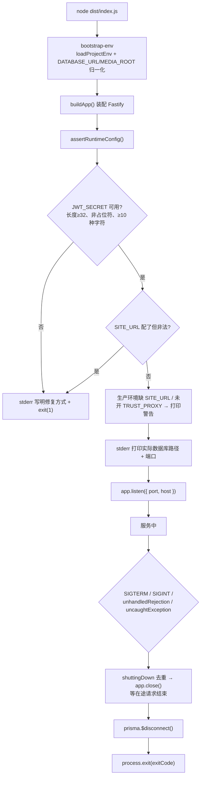

节点清单与设计意图：

| 步骤 | 意图 |
|---|---|
| 配置校验在 `listen()` 之前 | 以前 JWT_SECRET 缺失时进程照常启动、`/health` 返回 200，而每个签发/校验令牌的请求 500 |
| 数据库路径写 stderr | 冒烟与测试脚本需要核对「以为连的库」和「实际连的库」 |
| 不用 `app.log` 输出启动路径 | pino 写 stdout 有缓冲，父进程通过管道拿不到及时输出 |
| `shuttingDown` 标志 | PM2 `kill_timeout` 5 秒后 SIGKILL，必须先去重再关 |
| 捕获 `unhandledRejection` | 先记录结构化日志再退出，而不是带着未知状态继续服务 |

## 7. 登录流程（含管理员锁定）

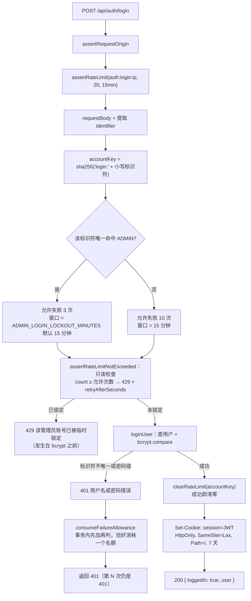

必须保持的不变量：

1. **判定阈值与失败记录使用同一个数字**。阈值 = 允许次数，第 N 次失败仍返回 401，第 N+1 次才拒绝。把阈值当「检查上限 +1」或把记录数封顶，都会让锁定静默失效。
2. **检查在密码校验之前，但只读**。管理员锁定的拒绝发生在 bcrypt 之前（爆破拿不到算力优势）；同时锁定键是账号维度（`auth:login:account:<sha256>`），换 IP 无效，窗口不会因为持续请求被续期。
3. **消耗名额是原子的**。「读计数 → 判定 → 记录失败」三步并发下会漏（实测 4 个并发全部 401 而锁定不触发），因此改为事务内先加再判。
4. **只有 401 才占名额**。400（畸形请求）与 500 不占，否则每次畸形请求都能把管理员推向锁定。
5. **被接受的取舍**：知道管理员用户名的人可以故意输错 3 次把站长锁在门外最多 15 分钟；对单管理员个人博客，这比允许无限次穷举更可接受。冷却窗口由 `ADMIN_LOGIN_LOCKOUT_MINUTES` 调整，上限 24 小时。

## 8. 注册与邮箱验证码

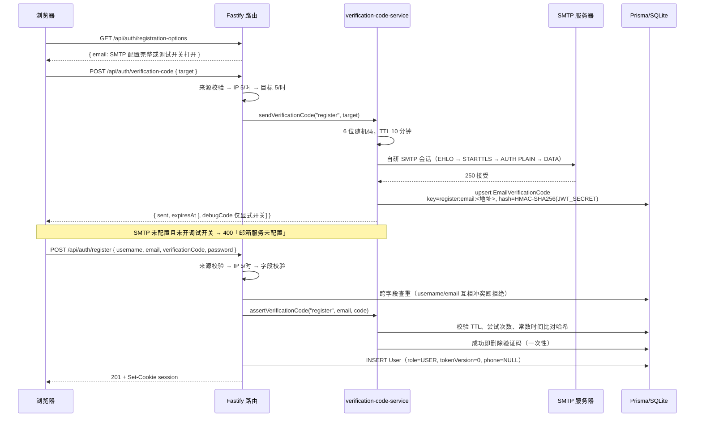

要点：

- **验证码按用途加前缀**（`register:email:<地址>` / `reset:email:<地址>`）：注册码不能拿去重置密码，反之亦然。
- **哈希用 HMAC-SHA256（密钥为 `JWT_SECRET`）**，比对用 `timingSafeEqual`；错误尝试累加 `attempts`，达到 5 次即删除并要求重新获取。
- **`debugCode` 回显必须显式开启**（`ALLOW_DEBUG_VERIFICATION_CODE=true`）。不能用 `NODE_ENV !== "production"` 判断：漏设 NODE_ENV 时会把真实验证码返回给任何人。
- **SMTP 未加密即拒绝发送凭据**，除非显式 `SMTP_ALLOW_INSECURE=true`（本机中继场景）。
- **重置密码流程对未注册邮箱表现一致**（同样的响应与流程），否则该端点会变成账号枚举工具；校验码先于账号查找。
- 手机号通道当前**未实现**：`User.phone` 列仍保留且唯一，但注册写入 `NULL`，登录查询只用 `username`/`email`。

## 9. 密码重置与改密

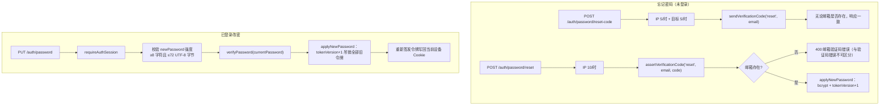

密码规则三处共用同一实现（注册、重置、改密）：最少 8 个字符，**最多 72 个 UTF-8 字节**（bcrypt 的输入上限，按字节而非字符计）。

## 10. 会话校验与吊销

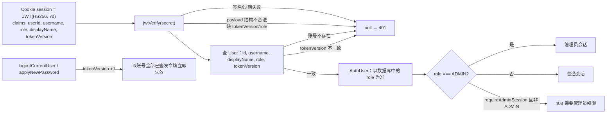

设计要点：

- 数据库中的角色优先于令牌中的角色，令牌代次比对**复用本来就要做的用户查询**，不增加额外往返。
- 登出会自增代次，使被盗令牌立即失效，代价是该账号在所有设备下线（单用户博客的预期语义）。
- 改密同样吊销全部旧令牌，但为当前设备补发新令牌，避免用户把自己踢下线。

## 11. 文章写入流程（后台 CRUD）

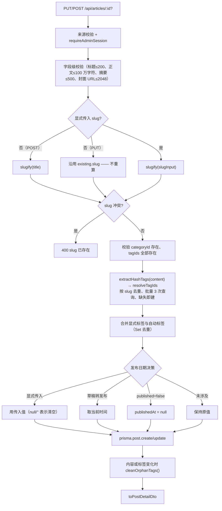

必须保持的行为：

1. **slug 只在显式传入时变化**。曾经的实现是 `slugify(slugInput || title || existing.title)`，导致「只改正文/封面」也会换掉文章 URL、断掉全部外链；现有回归测试钉住这一点。
2. **未显式提供 `tagIds` 时沿用文章已有标签**（曾经的 `stringArray(undefined)` 返回空数组，会静默丢失手工标签）。
3. **标签按 slug 去重而不是按名字**：「Next.js」「NextJS」归一为同一 slug，否则会解析出重复 tagId 并撞 `(postId, tagId)` 复合主键（表现为 500）。
4. **发布日期支持回填**：`publishedAt` 未提供、显式清空、合法日期三种语义分开处理。
5. 删除文章会级联删除其评论与标签关联，但 `postId` 为 `null` 的留言板留言不受影响（`ON DELETE CASCADE` 只在有外键值时触发）。

## 12. 发布与导入

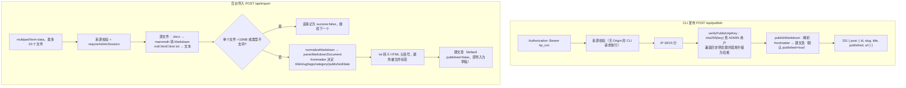

要点：

- 两条凭据通路**互相独立**：管理员会话不能调用 `/api/publish`（无 Bearer Key 即 401），发布 Key 也不能代替会话访问管理端点。
- 发布 Key 只以 SHA-256 哈希存储；`GET /api/auth/key` 只报告「是否已设置」，绝不回显。
- 分类解析先按 slug 查（同 slug 改名）、再按 name 查（同名不同 slug），最后新建；直接 `upsert({ where: { slug } })` 会撞 `Category.name` 唯一约束。
- 导入是**部分成功语义**：单个文件失败不影响其它文件，逐条返回 `{ success, title, error }` 与汇总 `{ imported, failed }`。

## 13. 评论与留言板（复用同一张表）

```mermaid
flowchart TD
  subgraph create["提交"]
    C1["POST /api/comments（需 postId）<br/>POST /api/guestbook（忽略 body 里的 postId）"] --> C2["来源校验 + IP 10/10 分"]
    C2 --> C3{"已登录?"}
    C3 -->|"是"| C4["用账号的 displayName/username 与 email 覆盖客户端传值"]
    C3 -->|"否"| C5["使用客户端昵称/邮箱"]
    C4 --> C6["长度与邮箱格式校验（昵称≤32、正文≤2000）"]
    C5 --> C6
    C6 --> C7{"文章评论?"}
    C7 -->|"是"| C8["文章必须存在且已发布，否则 404"]
    C7 -->|"留言板"| C9["无需文章"]
    C8 --> C10{"有 parentId?"}
    C9 --> C10
    C10 -->|"是"| C11["父评论必须同归属、已审核、且本身不是回复（只允许一级）"]
    C10 -->|"否"| C12
    C11 --> C12["INSERT approved=false（先审后发）"]
    C12 --> C13["201 { id, pendingReview: true }"]
  end

  subgraph read["公开读取"]
    R1["GET /api/public/guestbook 或 GET /api/comments?postId="] --> R2["只取 approved=true 的顶层评论<br/>createdAt DESC, id DESC 分页"]
    R2 --> R3["每条带全部已审核回复（回复不分页，createdAt ASC, id ASC）"]
  end

  subgraph admin["管理"]
    M1["GET /api/comments?approved=&scope=post|guestbook"] --> M2["requireAdminSession"]
    M3["PUT /api/comments/:id { approved }"] --> M2
    M4["DELETE /api/comments/:id"] --> M2
  end
```

状态机：

```mermaid
xxxxxxxxxx#mermaidChart11{font-family:sans-serif;font-size:16px;fill:#333;}@keyframes edge-animation-frame{from{stroke-dashoffset:0;}}@keyframes dash{to{stroke-dashoffset:0;}}#mermaidChart11 .edge-animation-slow{stroke-dasharray:9,5!important;stroke-dashoffset:900;animation:dash 50s linear infinite;stroke-linecap:round;}#mermaidChart11 .edge-animation-fast{stroke-dasharray:9,5!important;stroke-dashoffset:900;animation:dash 20s linear infinite;stroke-linecap:round;}#mermaidChart11 .error-icon{fill:#552222;}#mermaidChart11 .error-text{fill:#552222;stroke:#552222;}#mermaidChart11 .edge-thickness-normal{stroke-width:1px;}#mermaidChart11 .edge-thickness-thick{stroke-width:3.5px;}#mermaidChart11 .edge-pattern-solid{stroke-dasharray:0;}#mermaidChart11 .edge-thickness-invisible{stroke-width:0;fill:none;}#mermaidChart11 .edge-pattern-dashed{stroke-dasharray:3;}#mermaidChart11 .edge-pattern-dotted{stroke-dasharray:2;}#mermaidChart11 .marker{fill:#333333;stroke:#333333;}#mermaidChart11 .marker.cross{stroke:#333333;}#mermaidChart11 svg{font-family:sans-serif;font-size:16px;}#mermaidChart11 p{margin:0;}#mermaidChart11 defs #statediagram-barbEnd{fill:#333333;stroke:#333333;}#mermaidChart11 g.stateGroup text{fill:#9370DB;stroke:none;font-size:10px;}#mermaidChart11 g.stateGroup text{fill:#333;stroke:none;font-size:10px;}#mermaidChart11 g.stateGroup .state-title{font-weight:bolder;fill:#131300;}#mermaidChart11 g.stateGroup rect{fill:#ECECFF;stroke:#9370DB;}#mermaidChart11 g.stateGroup line{stroke:#333333;stroke-width:1;}#mermaidChart11 .transition{stroke:#333333;stroke-width:1;fill:none;}#mermaidChart11 .stateGroup .composit{fill:white;border-bottom:1px;}#mermaidChart11 .stateGroup .alt-composit{fill:#e0e0e0;border-bottom:1px;}#mermaidChart11 .state-note{stroke:#aaaa33;fill:#fff5ad;}#mermaidChart11 .state-note text{fill:black;stroke:none;font-size:10px;}#mermaidChart11 .stateLabel .box{stroke:none;stroke-width:0;fill:#ECECFF;opacity:0.5;}#mermaidChart11 .edgeLabel .label rect{fill:#ECECFF;opacity:0.5;}#mermaidChart11 .edgeLabel{background-color:rgba(232,232,232, 0.8);text-align:center;}#mermaidChart11 .edgeLabel p{background-color:rgba(232,232,232, 0.8);}#mermaidChart11 .edgeLabel rect{opacity:0.5;background-color:rgba(232,232,232, 0.8);fill:rgba(232,232,232, 0.8);}#mermaidChart11 .edgeLabel .label text{fill:#333;}#mermaidChart11 .label div .edgeLabel{color:#333;}#mermaidChart11 .stateLabel text{fill:#131300;font-size:10px;font-weight:bold;}#mermaidChart11 .node circle.state-start{fill:#333333;stroke:#333333;}#mermaidChart11 .node .fork-join{fill:#333333;stroke:#333333;}#mermaidChart11 .node circle.state-end{fill:#9370DB;stroke:white;stroke-width:1.5;}#mermaidChart11 .end-state-inner{fill:white;stroke-width:1.5;}#mermaidChart11 .node rect{fill:#ECECFF;stroke:#9370DB;stroke-width:1px;}#mermaidChart11 .node polygon{fill:#ECECFF;stroke:#9370DB;stroke-width:1px;}#mermaidChart11 #statediagram-barbEnd{fill:#333333;}#mermaidChart11 .statediagram-cluster rect{fill:#ECECFF;stroke:#9370DB;stroke-width:1px;}#mermaidChart11 .cluster-label,#mermaidChart11 .nodeLabel{color:#131300;}#mermaidChart11 .statediagram-cluster rect.outer{rx:5px;ry:5px;}#mermaidChart11 .statediagram-state .divider{stroke:#9370DB;}#mermaidChart11 .statediagram-state .title-state{rx:5px;ry:5px;}#mermaidChart11 .statediagram-cluster.statediagram-cluster .inner{fill:white;}#mermaidChart11 .statediagram-cluster.statediagram-cluster-alt .inner{fill:#f0f0f0;}#mermaidChart11 .statediagram-cluster .inner{rx:0;ry:0;}#mermaidChart11 .statediagram-state rect.basic{rx:5px;ry:5px;}#mermaidChart11 .statediagram-state rect.divider{stroke-dasharray:10,10;fill:#f0f0f0;}#mermaidChart11 .note-edge{stroke-dasharray:5;}#mermaidChart11 .statediagram-note rect{fill:#fff5ad;stroke:#aaaa33;stroke-width:1px;rx:0;ry:0;}#mermaidChart11 .statediagram-note rect{fill:#fff5ad;stroke:#aaaa33;stroke-width:1px;rx:0;ry:0;}#mermaidChart11 .statediagram-note text{fill:black;}#mermaidChart11 .statediagram-note .nodeLabel{color:black;}#mermaidChart11 .statediagram .edgeLabel{color:red;}#mermaidChart11 #dependencyStart,#mermaidChart11 #dependencyEnd{fill:#333333;stroke:#333333;stroke-width:1;}#mermaidChart11 .statediagramTitleText{text-anchor:middle;font-size:18px;fill:#333;}#mermaidChart11 :root{--mermaid-alt-font-family:sans-serif;}进程生命周期为外框、单次请求为主线，把 §4/§15/§16/§17/§19 压成一条主干——业务域只画成分派出的四个分支，
每个分支再对应一张已有的详提交评论/留言（approved=false）PUT /api/comments/:id { approved: true }DELETEPUT { approved: false }（撤回）DELETE待审核已通过已删除
```

边界规则（已有测试覆盖）：

- **归属由端点决定**：留言板端点忽略请求体中的 `postId`，客户端无法把留言挂到文章上。
- **回复不跨域**：查父评论时 `postId` 参与匹配，留言板与文章评论不能互相回复。
- **限流分开计数**：`comments:create:*` 与 `guestbook:create:*` 各自计数。
- 公开 DTO 不含邮箱与 `postId`；管理 DTO 额外给出 `scope`，避免前端靠 `post === null` 猜。

## 14. 音乐上传与删除

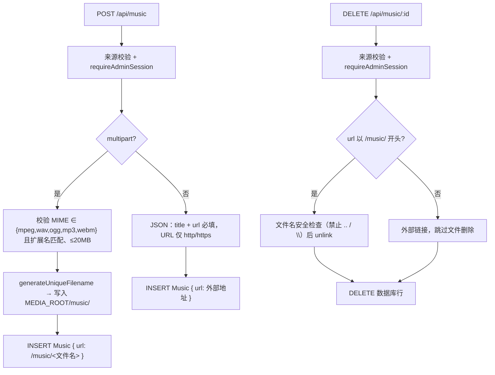

- 图片上传端点已移除：封面、正文配图与头像都是自由文本 URL，走外部图床。
- Fastify multipart 限制：单文件 20 MB、单请求 20 个文件；媒体服务再按类型与 20 MB 复核一次。
- 删除时数据库行是权威：本地文件缺失也不报错。

## 15. 公开数据面（SSR 读取路径）

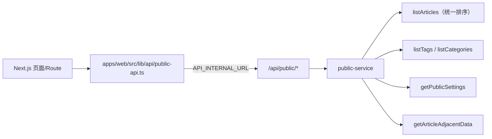

各端点特征与硬边界：

| 端点 | 数据特征 | 边界 |
|---|---|---|
| `/public/home` | 最近 6 篇 + 分类 + 标签 | 三查询并行 |
| `/public/article-index` | 分页文章摘要 | 默认 10，上限 50 |
| `/public/tags/{slug}`、`/public/categories/{slug}` | 归档头部 + 分页文章 | 同上 |
| `/public/articles/{slug}` | 文章详情 | 始终带 `published: true`；不存在返回 `data: null` |
| `/public/articles/{slug}/adjacent` | 上一篇/下一篇/相关阅读 | 相邻两篇按排序键直接查询，相关池上限 60、取 3 |
| `/public/archive` | 按年分组的全部已发布文章 | 上限 5000 条 |
| `/public/rss-data` | 最近 20 篇 + 站点信息 | 由 Web 渲染成 XML |
| `/public/sitemap-data` | 文章 + 标签 + 分类 slug | 每类上限 50000（sitemap 协议上限） |

两个必须一起改的地方：

- **统一排序 `POST_ORDER_DESC`**（`publishedAt desc, createdAt desc, id desc`）：分页的 `skip/take` 要求全序，仅按 `publishedAt` 排序时同时间戳的文章顺序不确定，翻页会漏项或重复；列表页与「上一篇/下一篇」必须共用同一规则。
- **相关阅读打分**：共享标签权重 2、同分类权重 1，同分时保持排序顺序；分类与标签都无交集时回退到最新文章，避免整块留空。

`GET /api/tags` 只返回**至少有一篇已发布文章**的标签（挡掉导入产生的空标签），而 `GET /api/categories` 不过滤（分类是少量、刻意维护的导航结构）。

搜索使用 `LIKE '%q%'` 全表扫描（`q` 在路由层截断到 100 字符）。**不要迁移到 SQLite FTS5**：`unicode61` 把连续中文当作单个 token（中文查询全部落空），`trigram` 只索引长度 ≥3 的片段，而中文最常见搜索词是 2 个字——迁移会造成功能倒退。触发重新评估的条件是文章达到数千篇。

## 16. 限流体系

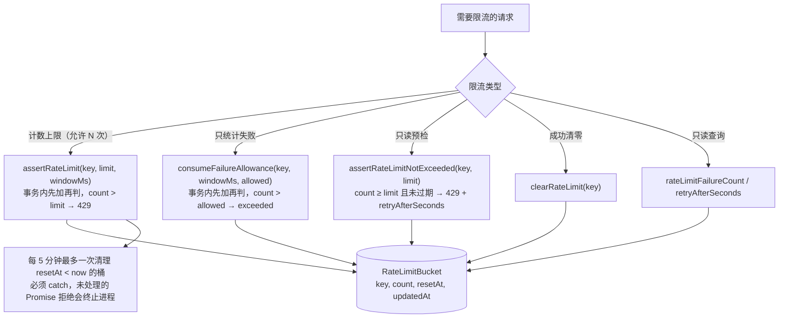

| 场景 | 键 | 阈值 | 窗口 |
|---|---|---|---|
| 发送验证码（注册） | `auth:verification-code:ip:<ip>`、`...:target:<sha256>` | 各 5 | 1 小时 |
| 注册 | `auth:register:<ip>` | 5 | 1 小时 |
| 登录（IP） | `auth:login:<ip>` | 20 | 15 分钟 |
| 登录（账号） | `auth:login:account:<sha256>` | 管理员 3 / 普通 10（仅失败） | 15 分钟（管理员可配） |
| 重置验证码 | `auth:reset-code:ip:<ip>`、`...:target:<sha256>` | 各 5 | 1 小时 |
| 重置密码 | `auth:password-reset:<ip>` | 10 | 1 小时 |
| 评论 | `comments:create:<ip>` | 10 | 10 分钟 |
| 留言板 | `guestbook:create:<ip>` | 10 | 10 分钟 |
| 发布 | `publish:<ip>` | 30 | 15 分钟 |

客户端 IP 的取法（**安全边界，不要放宽**）：

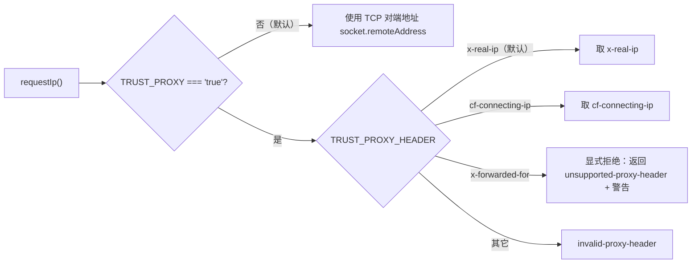

`x-forwarded-for` 被刻意拒绝：它是可追加的列表头，Nginx 常用的 `$proxy_add_x_forwarded_for` 会把客户端自带值留在最左端，取最左项等于让攻击者自选限流桶（实测 6/6 次绕过发码限额）。

同源校验（`assertSameOrigin`）规则：

1. `Origin` 命中配置来源（`SITE_URL`、`NEXT_PUBLIC_SITE_URL`、`ALLOWED_ORIGINS`）→ 放行；本机回环别名自动等价。
2. 开发环境额外放宽：本机网卡地址（含 DHCP 局域网 IP）任意端口都算同源。生产不适用。
3. 完全未配置可信来源时，退化为「Origin === Host」并打印一次告警（无法防御 DNS rebinding）。
4. 无 `Origin` 时回退比对 `Referer`；两者都没有则放行（CLI 场景）。

## 17. 错误与响应契约

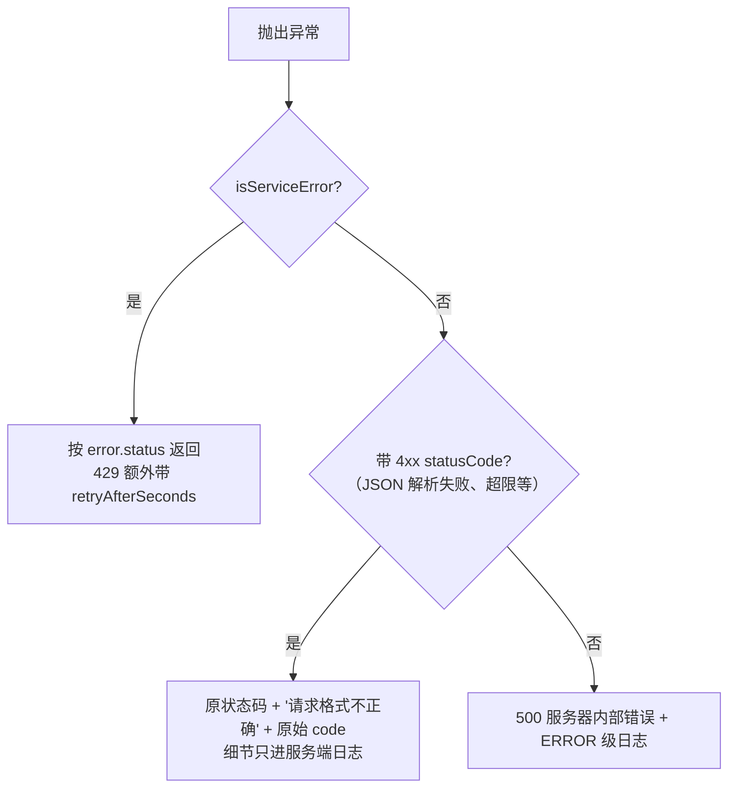

- 成功：`{ success: true, data: T }`；失败：`{ success: false, error: { code, message, retryAfterSeconds? } }`。
- 错误码集合：`BAD_REQUEST`、`UNAUTHORIZED`、`FORBIDDEN`、`NOT_FOUND`、`CONFLICT`、`TOO_MANY_REQUESTS`、`INTERNAL_ERROR`。
- `requestBody()` 在 HTTP 边界把缺失或非对象请求体统一归一为 400（此前会以 500 呈现，把客户端错误报成服务端错误）。`/api/profile` 与 `/api/settings` 不走它，由各自的服务函数校验并同样返回 400。
- `error-envelope.test.ts` 钉住「每个失败响应都是可解析的 JSON envelope」与「429 必带 retryAfterSeconds」两条 UI 依赖的保证。

## 18. 数据模型

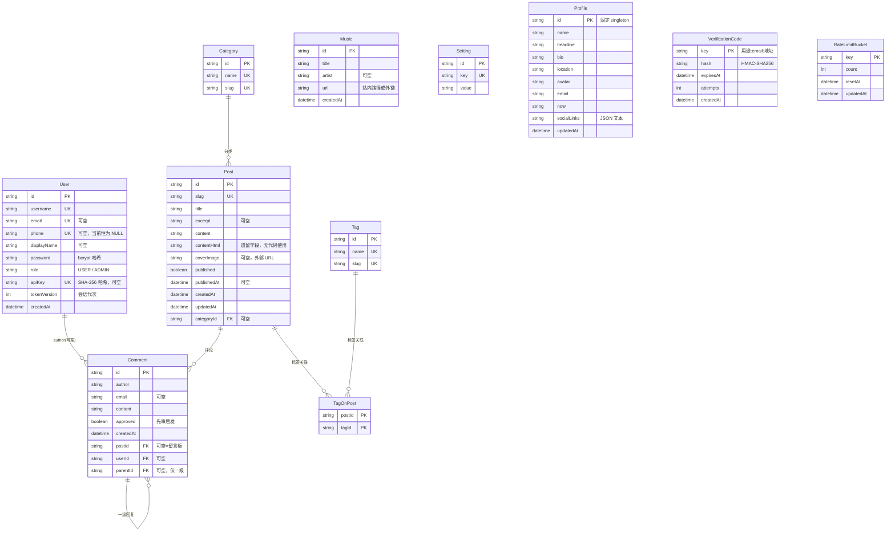

索引与约束意图：

| 索引 | 服务的查询 |
|---|---|
| `Post(published, publishedAt)` | 文章列表、归档、sitemap 的主排序路径 |
| `Post(categoryId)` | 分类页与 `getArticleAdjacentData` 的同分类候选 |
| `TagOnPost(tagId)` | 按标签反查文章、标签云计数（复合主键只覆盖 `(postId, tagId)` 方向） |
| `Comment(postId, approved)` | 文章评论/留言板的公开列表 |
| `Comment(parentId)` | 回复按 `parentId IN (...)` 批量取（缺失时每次打开文章页都全表扫描） |
| `Comment(userId)` | 账号维度关联 |
| `VerificationCode(expiresAt)` | 过期验证码清理 |
| `RateLimitBucket(resetAt)` | 过期限流桶清理 |
| 唯一约束 | `User.username/email/phone/apiKey`、`Post.slug`、`Category.name/slug`、`Tag.name/slug`、`Setting.key` |

数据存放约定：`socialLinks` 以 JSON 文本存单列（总是整体读写、条目数量小），读取时解析失败降级为空数组而不是整页 500；`Profile` 用固定主键 `singleton` 让并发写入天然收敛到同一行。

## 19. 健康检查

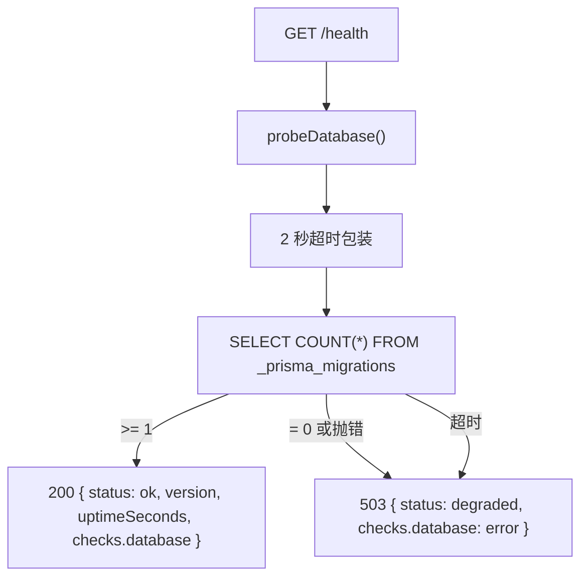

为什么查迁移表而不是 `SELECT 1`：SQLite 在文件不存在但目录存在时会**静默创建空库**，`SELECT 1` 照样成功，于是 `/health` 返回 200 而所有数据端点 500。`_prisma_migrations` 只有真正迁移过的库才有。错误细节只进日志，不进响应（健康检查是公开的）。

## 20. 测试与验证

| 测试文件 | 覆盖内容 |
|---|---|
| `apps/api/tests/api.test.ts` | 文章 CRUD、分页、搜索、草稿可见性、设置与标签 |
| `apps/api/tests/authorization.test.ts` | 角色 × 受保护端点的完整授权矩阵（含 403 文案核对） |
| `apps/api/tests/journey.test.ts` | 真实 HTTP + 真实 Cookie 的注册→评论→审核→登出旅程 |
| `apps/api/tests/login-hardening.test.ts` | 管理员 3 次锁定、并发原子性、换 IP 无效、窗口不续期 |
| `apps/api/tests/error-envelope.test.ts` | 失败响应必为 JSON envelope、429 必带 retryAfterSeconds |
| `apps/api/tests/comments.test.ts`、`guestbook.test.ts` | 审核状态机、一级回复、归属隔离、级联删除 |
| `apps/api/tests/origin-guard.test.ts` | 同源规则、回环别名、代理头拒绝 |
| `apps/api/tests/health*.test.ts` | 健康探测与空库/未迁移库的降级 |
| `apps/api/tests/publishing.test.ts`、`services.test.ts` | 发布、导入、slug/标签解析、排序全序 |
| `apps/api/tests/password.test.ts`、`smtp.test.ts`、`profile.test.ts`、`settings-env.test.ts`、`media.test.ts`、`archive.test.ts`、`slug-parity.test.ts`、`version-consistency.test.ts` | 密码强度与吊销、SMTP 会话与诊断、资料校验、环境校验、音乐、归档、前后端 slug 一致性、版本一致性 |

隔离方式：每个测试文件在独立进程中运行，`createTestDatabase()` 建临时目录 + `prisma migrate deploy` 得到独立 SQLite 库；`tests/helpers/offline-env.ts` 把 SMTP 钉成未配置，避免测试真的发信。

## 21. 契约与门禁

| 门禁 | 作用 |
|---|---|
| `npm run check:openapi` | 真实构建 Fastify 实例、读取注册路由表，与 `docs/openapi.yaml` 双向比对（实现未记录 / 文档写了不存在的路由都报错），并自解析 YAML 做同层重复键检测 |
| `npm run check:docs` | 校验 Markdown 本地链接、文档索引、内联代码中的仓库路径、源码环境变量是否都写进 `.env.example`、以及「dotenv 只能由 `scripts/load-env.mjs` 依赖」 |
| `npm test` | 120 个用例，覆盖服务层与 HTTP 层 |
| `npm run smoke` / `npm run smoke:prod` | 起临时数据库 + API + Web 的浏览器冒烟 |

新增功能的标准顺序：定义 DTO → 在 `server/<domain>` 实现并测试业务规则 → 在 `routes` 暴露接口并补注入测试 → 跨应用类型进 `packages/contracts` → 更新 `docs/openapi.yaml`。

## 22. 改动前必读的不变量清单

1. 写操作必须**先来源校验、再限流、再鉴权**，且没有豁免名单。
2. 管理员锁定的**判定阈值与失败记录必须用同一个数字**；检查在 bcrypt 之前但只读；名额消耗必须原子。
3. `slugify` 在 API 与 Web 各有一份实现，`apps/api/tests/slug-parity.test.ts` 强制一致；只改一边会立刻失败。
4. `POST_ORDER_DESC` 是分页与相邻文章的唯一排序来源，必须保持全序（`id` 是决胜键）。
5. slug 只在显式传入时变化；未传 `tagIds` 时保留原标签。
6. 令牌校验必须比对 `tokenVersion`；登出与改密必须自增它。
7. 公开 DTO 不得包含 `password`、`email`（评论公开面）、`apiKey`、验证码哈希、限流记录。
8. 客户端 IP 只信任代理会覆盖的单值头；`x-forwarded-for` 必须继续被拒绝。
9. 响应压缩钩子必须挂在根实例上（`addHook`），不能用 `register` 装插件。
10. 健康检查必须查 `_prisma_migrations`，不能退回 `SELECT 1`。
11. 未处理的 Promise 拒绝必须被捕获：限流桶清理与验证码清理都是即发即忘的写入。
12. 环境加载只有一处实现（`scripts/load-env.mjs`）；任何新环境变量都要同时进 `.env.example`，否则 `npm run check` 失败。

## 23. 附录：流程清单与执行顺序

后端一共 **53 个流程条目**，分四层：进程级（3）、每个请求都走的横切管线（10）、业务域（36：认证 11、内容 9、互动 6、媒体/设置/资料 6、公开数据面 4）、运维与门禁（4）。
画图建议顺序：先画横切管线（它是所有业务流程的共同骨架），再按域画业务流程，最后补进程级与运维流程。

### 23.1 流程依赖总览

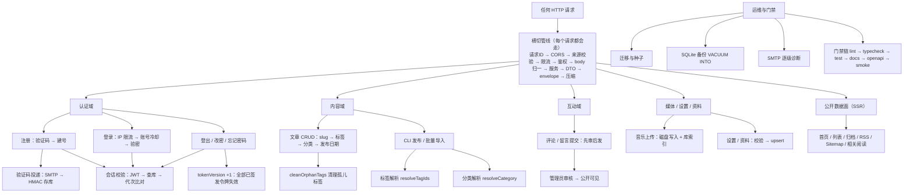

### 23.2 进程级流程

| # | 流程 | 触发 | 顺序 |
|---|---|---|---|
| 1 | 进程启动 | `node dist/index.js` | 加载环境（`loadProjectEnv` → DATABASE_URL 绝对化 → MEDIA_ROOT 兜底）→ 装配 Fastify → 配置校验（JWT_SECRET / SITE_URL 不合格即退出，生产缺配置只告警）→ stderr 打印库路径与警告 → `listen()` → 注册信号处理 |
| 2 | 优雅关闭 | SIGTERM / SIGINT / unhandledRejection / uncaughtException | 去重标志 → `app.close()`（停收新连接 → 等在途请求 → onClose）→ `prisma.$disconnect()` → `process.exit(code)` |
| 3 | 健康检查 | `GET /health` | 2 秒超时探针 `COUNT(*) FROM _prisma_migrations` → ≥1 为 ok/200，0、抛错或超时为 degraded/503（细节只进日志） |

### 23.3 横切管线流程（每个请求都走，顺序固定）

| # | 流程 | 顺序 |
|---|---|---|
| 4 | 请求 ID | 读 `x-request-id` → 正则校验（8–128 位安全字符）→ 不合格则 randomUUID → onSend 回写响应头 |
| 5 | CORS 判定 | 读 Origin → 无 Origin 放行 → `isAllowedOrigin(origin)` 决定是否授权（与同源校验共用一份规则） |
| 6 | 同源校验（仅写操作） | 有 Origin → 命中配置来源则放行；否则 403 → 未配置任何来源时退化为 Origin===Host（告警一次）→ 无 Origin 时回退看 Referer → 两者都没有则放行（CLI） |
| 7 | 限流 | 按路由选原语：`assertRateLimit`（计数型，先加再判）或 `assertRateLimitNotExceeded`（只读预检）→ 超限 429（可带 retryAfterSeconds）→ 顺带每 5 分钟清理一次过期桶 |
| 8 | 会话校验 | 读 Cookie → 无则 401 → `jwtVerify` → payload 结构校验 → 查库取当前 role/tokenVersion → 代次不一致即失效 → `requireAdminSession` 再判角色（403） |
| 9 | 请求体归一 | `requestBody()`：缺失或非对象 → 400；否则原样交给服务层做字段校验（profile/settings 由服务自行校验） |
| 10 | 领域服务执行 | 字段校验 → 业务规则 → Prisma 读写 → 抛 `ServiceError` 或返回实体 |
| 11 | DTO 转换 | Prisma 记录 → `toXxxDto()`：Date→ISO 字符串、关联扁平化、剥离敏感字段 |
| 12 | 响应封装与压缩 | `apiSuccess` 包 envelope → onSend：`Vary: Accept-Encoding` → 文本类且 >1 KB 且未压缩时 br 优先、gzip 次之 → 追加 `X-Request-Id` |
| 13 | 错误处理 | 异常 → `isServiceError` 用其 status/code → 否则 Fastify 4xx 原状态码 + 泛化文案 → 否则 500（错误细节只进日志） |

### 23.4 认证域流程

| # | 流程 | 顺序 |
|---|---|---|
| 14 | 注册能力探测 | `GET /registration-options` → `smtpConfig() !== null \|\| ALLOW_DEBUG_VERIFICATION_CODE === "true"` |
| 15 | 发送验证码 | 来源校验 → 取 body → 归一化邮箱（非法 400）→ IP 5/时 → 目标（sha256）5/时 → 生成 6 位码（TTL 10 分钟）→ SMTP 投递（未配置且未开调试 → 400）→ HMAC-SHA256 存库并重置 attempts → 异步清理过期码 |
| 16 | 注册 | 来源校验 → IP 5/时 → 字段校验（用户名 2–32 且非邮箱格式、昵称 ≤32、邮箱格式、密码 ≥8 且 ≤72 字节）→ username/email 四向查重 → 校验验证码（一次性，成功后删除）→ INSERT User（role=USER、tokenVersion=0）→ 签发 JWT → Set-Cookie → 201 |
| 17 | 登录 | 来源校验 → IP 20/15 分 → 取标识符并哈希成账号键 → 判是否 ADMIN → 定阈值（管理员 3 次 / 普通 10 次）→ 只读预检（超限即 429，发生在 bcrypt 之前）→ 查用户 + bcrypt 比对 → 失败则原子消耗一个名额并返回 401 → 成功则清零计数 → 签发 JWT → Set-Cookie → 200 |
| 18 | 登出 | 来源校验 → 清 Cookie → 有会话则 tokenVersion+1（全部令牌失效）→ 恒返回成功 |
| 19 | 忘记密码（发码） | 来源校验 → IP 5/时 + 目标 5/时 → 发重置验证码 → 响应与邮箱是否存在无关 |
| 20 | 忘记密码（重置） | 来源校验 → IP 10/时 → 字段与密码强度校验 → 校验验证码 → 查用户（不存在与验证码错误同样报 400）→ 新哈希 + tokenVersion+1 |
| 21 | 已登录改密 | 来源校验 → requireAuthSession → 新密码强度校验 → 校验当前密码 → 新哈希 + tokenVersion+1 → 为当前设备补发新令牌 → 200 |
| 22 | 查看发布密钥 | requireAdminSession → 查 apiKey → 若为历史明文就地升级为哈希 → 只返回 `hasApiKey`，绝不回显 |
| 23 | 重置发布密钥 | 来源校验 → requireAdminSession → 生成 `kp_` + 24 字节随机 → 存 SHA-256 → 明文只在本次响应出现一次 |
| 24 | 发布鉴权 | 来源校验 → 解析 `Authorization: Bearer` → IP 30/15 分 → sha256 查 ADMIN 用户（未命中回退明文匹配并升级）→ 401 或放行 |

### 23.5 内容域流程

| # | 流程 | 顺序 |
|---|---|---|
| 25 | 文章创建 | 来源 → requireAdminSession → 标题/正文必填与长度 → `slugify(slug \|\| title)` 查重 → tagIds 数组校验 → 校验分类与标签存在 → 合并「显式标签 + 正文 #标签」→ published/发布日期/excerpt/封面校验 → create → DTO |
| 26 | 文章更新 | 来源 → requireAdminSession → 查现有文章（含标签）→ 字段校验 → 计算发布日期（显式 > 草稿转发布取当前 > 取消发布置空 > 保持）→ slug 仅在显式传入时重算并查重 → 组装字段 → 标签（内容或标签变化时：未传则沿用原标签 + 自动标签）→ 分类 connect/disconnect → update → 内容或标签变化时清孤儿标签 → DTO |
| 27 | 文章删除 | 来源 → requireAdminSession → 查存在 → delete（级联标签关联与评论）→ 清孤儿标签 → `{ deleted: true }` |
| 28 | 文章列表查询 | 可选会话 → 分页参数归一（默认 10、上限 50）→ 组装 where（非管理员强制 published；管理员 all/draft/默认；标签、分类、q 截断 100 的模糊匹配）→ 并行 findMany（统一全序）+ count → 分页结果 |
| 29 | 单篇读取与草稿可见性 | 可选会话 → 查详情 → 不存在或未发布且非管理员 → 404；公开路由始终带 `published: true`，未命中返回 `data: null` |
| 30 | CLI 发布 | 来源 → 取 Bearer Key → IP 30/15 分 → 校验 Key → content 必填 → 解析 frontmatter → 定 title/slug → slug 冲突报 409 → 合并标签 → 解析分类 → 定发布状态与日期 → create → 返回文章 URL |
| 31 | 批量导入 | 来源 → requireAdminSession → 收集 multipart → 逐文件：大小 ≤10 MB → 按扩展名转换（docx 走 mammoth，md/html/htm/txt 直读，其它拒绝）→ 归一化换行 → txt 转义尖括号 → 解析 frontmatter → 建草稿 → 单文件失败不中断，逐条返回结果 |
| 32 | 标签解析 | 名称 trim → slugify → 按 slug 去重 → 查已存在 → 缺失批量创建（忽略并发唯一冲突）→ 再查拿 id → 按输入顺序返回 |
| 33 | 分类解析 | 按 slug 查（命中且改名则更新 name）→ 未命中按 name 查 → 仍未命中则新建 |

### 23.6 互动域流程

| # | 流程 | 顺序 |
|---|---|---|
| 34 | 评论提交 | 来源 → IP 10/10 分 → 取 body → 可选会话 → postId 必填 → 已登录则用账号昵称/邮箱覆盖提交值 → 字段与长度校验 → 文章必须存在且已发布 → 父评论必须同归属、已审核、且本身不是回复 → INSERT（approved=false）→ 201 待审核 |
| 35 | 留言板提交 | 同上，但归属固定为留言板（忽略 body 的 postId）、限流键独立、不校验文章 |
| 36 | 公开评论/留言读取 | 分页归一（默认 20、上限 50）→ 只取已审核顶层评论（createdAt DESC, id DESC）→ 每条带全部已审核回复（createdAt ASC, id ASC）→ DTO 去邮箱 → 分页结果 |
| 37 | 管理端评论列表 | requireAdminSession → approved 过滤解析 → scope 过滤（文章/留言板）→ 并行查询 + count → 管理 DTO（含 email、所属文章、父评论、scope） |
| 38 | 评论审核 | 来源 → requireAdminSession → approved 必须为布尔（否则 400）→ 查存在 → 更新 → 管理 DTO |
| 39 | 评论删除 | 来源 → requireAdminSession → 查存在 → delete（级联回复） |

### 23.7 媒体、设置与资料流程

| # | 流程 | 顺序 |
|---|---|---|
| 40 | 音乐上传（文件） | 来源 → requireAdminSession → 判断 multipart → 类型白名单 + 扩展名 + ≤20 MB → 生成唯一文件名 → mkdir + 写盘 → INSERT 记录（url=/music/<文件名>）→ 201 |
| 41 | 音乐添加（外链） | 来源 → requireAdminSession → 标题/URL 必填与长度 → URL 必须 http(s) → INSERT → 201 |
| 42 | 音乐删除 | 来源 → requireAdminSession → 查记录 → 站内路径则做文件名安全检查后 unlink（失败忽略）→ 删除记录 |
| 43 | 站点设置读取 | 只查白名单两键 → 返回键值映射（公开端点） |
| 44 | 站点设置更新 | 来源 → requireAdminSession → body 必须是对象 → 逐键 trim + 非空 + 长度校验 → 事务内 upsert → `{ updated: true }` |
| 45 | 个人资料读取/写入 | 读：查 singleton 行，缺失返回空资料，JSON 解析失败降级为空数组；写：来源 → requireAdminSession → 逐字段校验（长度、头像站内路径或 http(s)、邮箱格式、社交链接 ≤12 条且 href 必须 http(s)）→ upsert singleton |

### 23.8 公开数据面流程（SSR 读取）

| # | 流程 | 顺序 |
|---|---|---|
| 46 | 首页 / 布局 / 设置 | 首页并行取最近 6 篇 + 分类 + 标签；布局并行取标签 + 最近 5 篇 + 站点设置；公开设置只回白名单键并给默认标题描述兜底 |
| 47 | 列表 / 归档页 / 归档年表 | 文章索引与标签/分类归档都走同一分页查询（上限 50）；归档取全部已发布（上限 5000 条）→ 按年份分组 → 无日期归入最后的 null 桶 |
| 48 | 文章相邻与相关阅读 | 查本文（分类 + 标签）→ 未命中返回 null → 并行取「更旧一篇」「更新一篇」「同分类或同标签候选池（上限 60）」→ 打分（同标签 ×2、同分类 ×1）→ 稳定排序取 3 → 无交集时回退最新 3 篇 |
| 49 | RSS / Sitemap 数据 | RSS 取最近 20 篇 + 站点设置；Sitemap 并行取文章/标签/分类 slug，各上限 50000 |

### 23.9 运维与门禁流程

| # | 流程 | 顺序 |
|---|---|---|
| 50 | 数据库迁移与种子 | `prisma migrate deploy` 建库/升级 → 种子：生产环境需显式开关 → 清空数据 → 建管理员（未给密码则随机生成并打印）→ 建两个分类 → 写两条设置 |
| 51 | SQLite 备份 | 校验目标为绝对路径且 DATABASE_URL 指向 SQLite → 用独立 Prisma 客户端执行 `VACUUM INTO` 得到一致性快照 → chmod 0600 → 失败则删除半成品 |
| 52 | SMTP 诊断 | 配置检查 → 连接 → 能力（EHLO/STARTTLS）→ 传输安全 → 认证 → 发件人，任一步失败即停并给出可执行提示；`--send` 再真发一封 |
| 53 | 提交前门禁 | lint → typecheck（4 个工作区）→ 单元测试（120）→ 文档校验 → OpenAPI 契约校验 → 浏览器冒烟 |

### 23.10 流程之间的顺序依赖（画图时别画反）

1. **横切管线包住所有业务流程**：任何业务流程的第一、二步都是「来源校验」和「限流」，不是业务逻辑。
2. **会话校验是受保护流程的前置**：`/auth/me`、`/auth/key`、`PUT /auth/password` 的校验在服务内部；其余在路由体。
3. **注册依赖验证码投递**；忘记密码同样复用验证码投递，只是用途前缀不同。
4. **改密/重置/登出都要先写库（tokenVersion+1）再签发新令牌**，顺序反了会把新令牌一起作废。
5. **发布与导入都依赖标签解析与分类解析**，且都在建文章之前完成解析。
6. **文章更新里「标签」在「分类」之前处理，孤儿标签清理在写库之后**。
7. **互动域是两段式**：提交（写入 pending）→ 管理员审核（置 approved）→ 公开读取才可见；画状态机而不是单链表。
8. **公开数据面只读**，不经过来源校验与限流，也不依赖会话（可选会话只影响草稿可见性）。

## 24. 总流程图（L0）

**总流程图回答一个问题：一个请求从进程启动到响应写出，究竟经过哪些环节、在每个环节可能从哪里失败。**
它以「进程生命周期」为外框、「单次请求」为主线，把 §4、§15、§16、§17、§19 的内容压成一条主干；业务域只画成**分派出的四个分支**，每个分支再对应一张已有的详细图（见 §24.2 放大关系表）。

它刻意省略的内容：具体字段校验规则、限流阈值、DTO 字段清单、查询细节——那些是 L1/L2 图的事。总图只保留三类信息：**顺序、分支、拒绝点**。

### 24.1 主干图

```mermaid
flowchart TD
  Boot["进程启动<br/>加载环境 → 装配 Fastify → 配置校验（不合格即退出）→ listen(127.0.0.1:3002)"]
  Boot --> Serving["服务中"]

  Browser["浏览器<br/>同源 /api/*"] --> Nginx["Nginx<br/>只暴露 Web"]
  CLI["发布 CLI<br/>Bearer Key"] --> Nginx
  Monitor["监控 / 负载均衡"] --> HealthEntry["GET /health（API 直连）"]
  Nginx --> Web["Next.js Web :3001<br/>rewrite → API_INTERNAL_URL"]
  Web --> Entry["请求进入 API"]

  HealthEntry --> HealthProbe["2 秒超时探针<br/>COUNT(_prisma_migrations)"]
  HealthProbe -->|"≥ 1"| HealthOk["200 status=ok"]
  HealthProbe -->|"0 / 抛错 / 超时"| HealthBad["503 status=degraded"]

  Entry --> Step1["① 请求 ID<br/>校验 x-request-id，否则 randomUUID"]
  Step1 --> Step2["② 插件层<br/>Cookie 解析 / Multipart 解析 / CORS 判定"]
  Step2 --> Match["③ 路由匹配"]
  Match --> IsWrite{"④ 是写操作?"}

  IsWrite -->|"否（读）"| Authz
  IsWrite -->|"是"| Step5["⑤ 同源校验<br/>Origin → 白名单；无 Origin 回退 Referer"]
  Step5 -->|"非法"| Reject403["403 非法请求来源"]
  Step5 -->|"通过"| Step6["⑥ 限流<br/>计数型 / 失败型 / 只读预检"]
  Step6 -->|"超限"| Reject429["429 请求过于频繁<br/>可带 retryAfterSeconds"]
  Step6 -->|"通过"| Authz{"⑦ 鉴权"}

  Authz -->|"未登录 / 令牌失效 / 代次不符"| Reject401["401 未登录"]
  Authz -->|"角色不足"| Reject403B["403 需要管理员权限"]
  Authz -->|"通过，或端点本就公开"| Dispatch{"⑧ 端点类别分派"}

  Dispatch -->|"公开数据面"| PubFlow["只读查询<br/>可选会话仅影响草稿可见性"]
  Dispatch -->|"认证域"| AuthFlow["验证码 / 注册 / 登录 / 重置 / 改密 / 登出 / 发布密钥"]
  Dispatch -->|"内容与互动域"| ContentFlow["文章 CRUD / 导入 / 评论审核 / 音乐 / 设置 / 资料"]
  Dispatch -->|"发布域"| PublishFlow["校验 Bearer API Key<br/>→ 解析 frontmatter → 建文章"]

  PubFlow --> Body
  AuthFlow --> Body
  ContentFlow --> Body
  PublishFlow --> Body
  Body["⑨ 请求体归一<br/>缺失或非对象 → 400"] --> Service["⑩ 领域服务<br/>字段校验 → 业务规则 → Prisma 读写"]

  Service --> Store[("SQLite<br/>媒体目录<br/>SMTP")]
  Service -->|"抛 ServiceError 或未知异常"| ErrHandler
  Service --> Dto["⑪ DTO 转换<br/>Date → ISO，剥离敏感字段"]
  Dto --> Envelope["⑫ 成功 envelope<br/>success:true / data"]
  Envelope --> Compress["⑬ onSend<br/>Vary: Accept-Encoding → br/gzip（>1 KB 文本）→ X-Request-Id"]
  Compress --> Response["响应"]

  Reject403 --> ErrHandler
  Reject429 --> ErrHandler
  Reject401 --> ErrHandler
  Reject403B --> ErrHandler
  ErrHandler["错误处理<br/>ServiceError 保状态码；Fastify 4xx 泛化文案；否则 500"] --> Fail["失败 envelope<br/>success:false / error"]
  Fail --> Compress

  Response --> Shut["SIGTERM / SIGINT<br/>停收新连接 → 等在途请求 → prisma.$disconnect() → exit"]
```

### 24.2 节点清单（主干 13 步）

| 步 | 环节 | 拒绝/失败出口 |
|---|---|---|
| ① | 请求 ID：校验 `x-request-id`，不合格则生成 UUID | —（总是成功，响应头回写同一 ID） |
| ② | 插件层：Cookie、Multipart（20 MB / 20 文件）、CORS 判定 | CORS 不授权该来源 |
| ③ | 路由匹配（`/health` 或 `/api/*`） | 404 |
| ④ | 判断读/写：只有写操作才走 ⑤⑥ | — |
| ⑤ | 同源校验（21 个写端点无例外） | 403 非法请求来源 |
| ⑥ | 限流 | 429（可带 `retryAfterSeconds`） |
| ⑦ | 鉴权：会话 → JWT → 查库 → 代次比对 → 角色 / API Key | 401 未登录、403 权限不足 |
| ⑧ | 端点类别分派（四个分支） | — |
| ⑨ | 请求体归一 | 400 请求体不能为空 / 必须是 JSON 对象 |
| ⑩ | 领域服务：字段校验、业务规则、Prisma 读写、外部副作用 | 400/404/409 等 `ServiceError` |
| ⑪ | DTO 转换 | — |
| ⑫ | 成功 envelope | — |
| ⑬ | onSend 压缩 + 请求 ID 回写 | — |
| — | 错误处理（横切，从 ⑤ 到 ⑩ 任意处进入） | 4xx 泛化 / 500 内部错误 |

### 24.3 放大关系（总图节点 → 详细图）

| 总图节点 | 展开到 |
|---|---|
| ① ② ③ ⑨ ⑪ ⑫ ⑬ + 错误处理 | §4 请求生命周期、§17 错误与响应契约 |
| ⑤ | §16 同源校验规则 |
| ⑥ | §16 限流体系（原语、阈值表、客户端 IP 解析） |
| ⑦ | §10 会话校验与吊销；§7 登录流程（含管理员冷却） |
| 认证域分支 | §7 登录、§8 注册与邮箱验证码、§9 密码重置与改密 |
| 内容与互动域分支 | §11 文章写入、§12 发布与导入、§13 评论与留言板、§14 音乐上传 |
| 发布域分支 | §12 发布与导入 |
| 公开数据面分支 | §15 公开数据面（SSR 读取路径） |
| 健康探针 | §19 健康检查 |
| 进程启动 / 关闭 | §6 启动与关闭流程 |
| 数据落地 | §18 数据模型、§16 限流桶 |

### 24.4 读图要点

1. **主干是一条直线，分叉只在两处**：读/写分叉（④）与端点类别分派（⑧）。画图时不要把这些分支画成并列泳道，它们是同一请求的连续阶段。
2. **拒绝点集中在四步**：403 来源（⑤）、429 限流（⑥）、401/403 鉴权（⑦）、400 请求体（⑨）。业务规则失败发生在 ⑩。
3. **错误处理是横切的**，不是主干的一步：任何一个 `throw` 都会跳到它，再统一回到 ⑬ 压缩与响应。
4. **`/health` 不经过 Web**：它属于 API 自己的进程探活路径，且不参与鉴权、限流、来源校验。
5. **公开读端点跳过 ⑤⑥**：这是「读操作不做来源校验」的设计结果，不是遗漏。
6. **副作用只发生在 ⑩**：数据库写入、限流桶、验证码、磁盘文件、SMTP 投递都在这一层，前后各步都是纯粹的 HTTP 处理。
